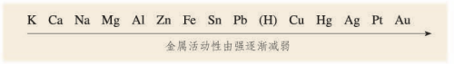

# 初中化学酸碱盐知识点总结

本文基于 [人民教育出版社](https://www.pep.com.cn/) [化学 九年级下册](https://www.pep.com.cn/products/jc/czjks/201510/t20151026_1250781.shtml) （2012 年 10 月第 1 版，2021 年 12 月重庆第十次印刷，ISBN 978-7-107-24498-8）编写，如有缺漏或错误之处欢迎通过 [Issue](https://github.com/LiCaoZ/summary-of-knowledge-points-in-junior-middle-school/issues) 指正或直接发起 Pull Request！

<!--more-->

## 酸

### 化学性质

酸拥有相同的化学性质是因为其均拥有相同的 $ H ^+ $ 离子

#### 与指示剂反应

酸可使紫色石蕊溶液变红，无色酚酞溶液不变色（石酸红，酚酸无）。

#### 与活泼金属反应

此处所指的「活泼金属」，是指在第八单元课题二（金属的化学性质）中金属活动性顺序表位于氢之前的金属。

通式：

$$ 酸 + 金属 \rightarrow 盐 + H_2 \uparrow  $$

例如：

稀硫酸（$ H_2 SO_4 $)和铁（$ Fe $）反应生成硫酸亚铁（$ Fe SO_4 $）和氢气（$ H_2 $）

$$ H_2 SO_4 + Fe = Fe SO_4 + H_2 \uparrow $$

**注意：** 此反应的基本反应类型为 **置换反应**，即单质换化合物生成单质与化合物。

#### 与盐反应

通式：

$$ 酸 + 盐 \rightarrow 新酸 + 新盐 $$

例如：

稀盐酸（$ HCl $）和碳酸钙（$ Ca CO_3 $）反应生成氯化钙（$ Ca Cl_2 $）和水（$ H_2 O $）和二氧化碳（$ CO_2 $）

$$ 2 HCl + Ca CO_3 = Ca Cl_2 + H_2 O + CO_2 \uparrow $$

**注意：** 此反应的基本反应类型为 **复分解反应**，因此其生成物需满足复分解反应的发生要求，即至少拥有水、（沉）淀、气（体）中的一种才可发生。